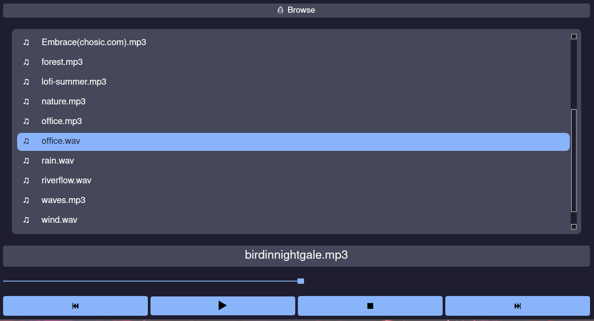

# Simple Music Player

[](LICENSE)
[](https://github.com/KISHOREkevin/simple-music-player/releases)

 

A simple yet powerful music player built with PyQt5 and QtMultimedia, designed for Linux desktops. Enjoy your favorite tunes with a clean and intuitive interface.

## ✨ Features

* **Audio Playback:** Supports common audio formats (MP3, OGG, FLAC, WAV, etc., depending on system GStreamer codecs).
* **Playlist Management:** Basic playlist functionality
* **Simple UI:** Straightforward controls for play, pause, stop, next, previous
* **Lightweight:** Packaged for minimal dependencies.

## 🚀 Getting Started

You have a few options to get and run My Music Player on your Linux system:

### 1. Download and Run the Pre-built Binary (Recommended for Users)

This is the easiest way to get the player running without installing any development tools.

1.  **Download the Executable:**
    Go to the [**Releases page**](https://github.com/YOUR_GITHUB_USERNAME/YOUR_REPOSITORY_NAME/releases) of this repository.
    Download the latest `music-player` executable file from the "Assets" section of the desired release.

2.  **Make it Executable:**
    Open your terminal, navigate to the directory where you downloaded the file, and make it executable:
    ```bash
    chmod +x music-player
    ```

3.  **Run the Player:**
    You can now run the application directly:
    ```bash
    ./music-player
    ```

    **Compatibility Note:** This binary was built on Arch Linux and is expected to work on most modern Linux Distribution. Compatibility with other distributions (e.g., Fedora, Arch) may vary depending on system libraries, especially GStreamer.

### 2. Install with the Provided Script (For a Better Desktop Integration)

This script automates copying the executable and creating a desktop entry, making it appear in your application menu.

1.  **Download Release Assets:**
    Go to the [**Releases page**](https://github.com/YOUR_GITHUB_USERNAME/YOUR_REPOSITORY_NAME/releases) and download:
    * The `music-player` executable
    * The `simple-music-player.desktop` file
    * The `install.sh` script
    Place them in the same directory (e.g., a new folder named `MyMusicPlayer`).

2.  **Make Script Executable:**
    Open your terminal, navigate to the directory where you downloaded the files, and make the script executable:
    ```bash
    chmod +x install.sh
    ```

3.  **Run the Installation Script:**
    Execute the script. It will copy the necessary files to your local `~/.local/bin` and `~/.local/share/applications` directories.
    ```bash
    ./install.sh
    ```
    You should now find "Simple music player" in your desktop environment's application menu.

### 3. Build from Source (For Developers)

If you want to contribute, customize, or understand the internals, you can build the application from its source code.

#### Prerequisites

* **Python 3.8+**
* **pip** (Python package installer)
* **PyQt5** (Python bindings for Qt)
* **PyInstaller** (for packaging)
* **GStreamer 1.0 and its plugins** (essential for QtMultimedia on Linux). Ensure you have packages like `gstreamer1.0-plugins-base`, `gstreamer1.0-plugins-good`, `gstreamer1.0-plugins-bad`, `gstreamer1.0-libav`, `gstreamer1.0-alsa`, etc., installed on your system.

#### Steps

1.  **Clone the Repository:**
    ```bash
    git clone [https://github.com/KISHOREkevin/simple-music-player.git](https://github.com/KISHOREkevin/simple-music-player.git)
    cd simple-music-player
    ```

2.  **Create and Activate a Virtual Environment (Recommended):**
    ```bash
    python3 -m venv .venv
    source .venv/bin/activate
    ```

3.  **Install Dependencies:**
    ```bash
    pip install -r requirements.txt
    ```

4.  **Run from Source (without PyInstaller build):**
    If you just want to run the Python script directly (for development):
    ```bash
    python music-player.py
    ```


5.  **Build the Executable with PyInstaller:**
    This project uses PyInstaller to create a standalone executable. The `.spec` file (`music-player.spec`) contains all the necessary configurations for bundling QtMultimedia's GStreamer dependencies.

    First, generate the `.spec` file (if you don't have it locally or if it's not committed):
    ```bash
    pyinstaller --onefile --windowed music-player.py
    ```
    Then, build using the `.spec` file (recommended as it includes custom paths):
    ```bash
    pyinstaller music-player.spec
    ```
    Alternatively, if you prefer to use the command directly:
    (Make sure these paths `YOUR_QT_PLUGINS_PATH` and `YOUR_GSTREAMER_LIB_PATH` are correct for your system. Use `find /usr -name "libgstreamer-1.0.so*"` and `ls -l` to verify.)
    ```bash
    pyinstaller --onefile --windowed \
        --add-data "/usr/lib/qt/plugins/mediaservice:PyQt5/Qt/plugins/mediaservice" \
        --add-data "/usr/lib/qt/plugins/platforms:PyQt5/Qt/plugins/platforms" \
        --add-data "/usr/lib/gstreamer-1.0:gstreamer-1.0" \
        --add-binary "/usr/lib/libgstreamer-1.0.so:." \
        --add-binary "/usr/lib/x86_64-linux-gnu/libgstbase-1.0.so:." \
        --add-binary "/usr/lib/x86_64-linux-gnu/libgstapp-1.0.so:." \
        music-player.py
    ```
    The final executable will be in the `dist/` directory.

### 4. Create a Desktop Entry Manually (Optional)

If you downloaded the binary directly and prefer not to use the `install.sh` script, you can manually create a `.desktop` file for better desktop integration.

1.  **Place your executable and icon:**
    Move `music-player` to a permanent location, e.g., `~/bin/` or `~/.local/bin/`.
    

2.  **Create the `.desktop` file:**
    Open a text editor and save the following content as `music-player.desktop` in `~/.local/share/applications/`:

    ```ini
    [Desktop Entry]
    Name=Simple Music Player
    Comment=A simple music player application
    Exec=/home/YOUR_USERNAME/bin/music-player  # <--- IMPORTANT: Replace with the actual path to your executable
    Terminal=false
    Type=Application
    Categories=AudioVideo;Player;
    StartupNotify=true
    Keywords=music;player;audio;mp3;
    ```
    **Remember to replace `/home/YOUR_USERNAME/...` with your actual paths!**

3.  **Make it Executable:**
    ```bash
    chmod +x ~/.local/share/applications/music-player.desktop
    ```

4.  **Update Desktop Database (Optional):**
    ```bash
    update-desktop-database ~/.local/share/applications/
    ```

## ⚠️ Troubleshooting

* **`GStreamer-WARNING: External plugin loader failed...`**:
    This is a common warning when bundling GStreamer-based applications with PyInstaller `--onefile`. If your application functions correctly (i.e., plays music), you can generally ignore this warning. It indicates that the GStreamer plugin *scanner* couldn't run, but the necessary plugins are still being found and loaded.

* **"no element 'identity'" or "No QtMultimedia backends found"**:
    These errors mean that the GStreamer plugins required by QtMultimedia are not being found by your packaged application.
    * **Solution:** Ensure your system has the core GStreamer packages installed (e.g., `gstreamer1.0-plugins-good`, `gstreamer1.0-libav`). If building from source, double-check your `pyinstaller` command to ensure all `gstreamer-1.0` plugin directories and core libraries are correctly included via `--add-data` and `--add-binary` flags, matching the paths on your build system.

## 🤝 Contributing

Contributions are welcome! If you find a bug or have a feature request, please open an issue. If you'd like to contribute code, feel free to fork the repository and submit a pull request.

## 📝 License

This project is licensed under the MIT License - see the [LICENSE](LICENSE) file for details.

---

**[Replace KISHOREkevin and simple-music-player with your actual GitHub details.]**
